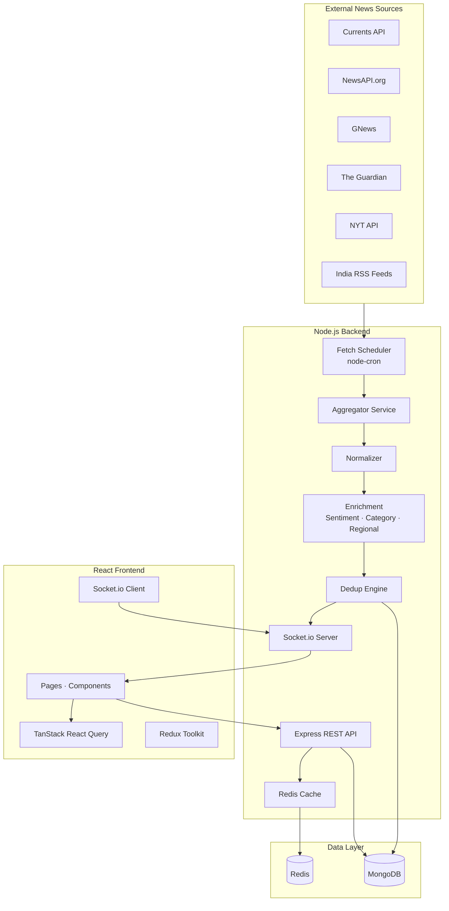
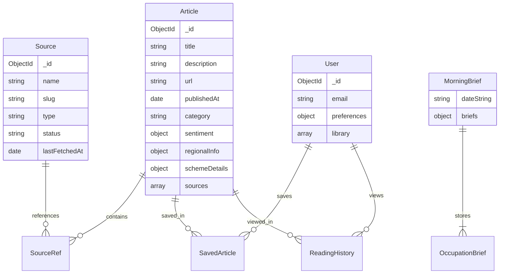

# InsightHub — News Intelligence Platform for India

**Project Report**

| Field | Detail |
|-------|--------|
| **Project Title** | InsightHub: A Multi-API News Intelligence Platform with Real-Time Aggregation and Personalization |
| **Technology Stack** | MERN (MongoDB, Express.js, React, Node.js), Redis, Socket.io |
| **Domain** | News aggregation, information retrieval, real-time systems, personalization |
| **Institution** | R.V. College of Engineering (RVCE) |
| **Authors** | Sachin (and team, as applicable) |

---

## Table of Contents

1. [Abstract](#1-abstract)
2. [Introduction](#2-introduction)
3. [Existing System Study and Project Objectives](#3-existing-system-study-and-project-objectives)
   - 3.1 [Literature Survey](#31-literature-survey)
   - 3.2 [Survey of Existing Systems](#32-survey-of-existing-systems)
   - 3.3 [Outcome of the Survey](#33-outcome-of-the-survey)
   - 3.4 [Project Objectives](#34-project-objectives)
4. [Project Architecture and Design](#4-project-architecture-and-design)
   - 4.1 [System Architecture Overview](#41-system-architecture-overview)
   - 4.2 [Backend Design](#42-backend-design)
   - 4.3 [Frontend Design](#43-frontend-design)
   - 4.4 [Database Design](#44-database-design)
   - 4.5 [API and WebSocket Design](#45-api-and-websocket-design)
5. [Methodology](#5-methodology)
   - 5.1 [Development Methodology](#51-development-methodology)
   - 5.2 [Data Ingestion Pipeline](#52-data-ingestion-pipeline)
   - 5.3 [Deduplication and Enrichment](#53-deduplication-and-enrichment)
   - 5.4 [Personalization and India Intelligence](#54-personalization-and-india-intelligence)
   - 5.5 [Testing and Quality Assurance](#55-testing-and-quality-assurance)
6. [Results](#6-results)
   - 6.1 [Functional Outcomes](#61-functional-outcomes)
   - 6.2 [Technical Performance](#62-technical-performance)
   - 6.3 [User Interface Outcomes](#63-user-interface-outcomes)
   - 6.4 [Limitations Observed](#64-limitations-observed)
7. [Execution Procedure](#7-execution-procedure)
   - 7.1 [Hardware and Software Requirements](#71-hardware-and-software-requirements)
   - 7.2 [Environment Setup](#72-environment-setup)
   - 7.3 [Installation Steps](#73-installation-steps)
   - 7.4 [Running the Application](#74-running-the-application)
   - 7.5 [Deployment Procedure](#75-deployment-procedure)
8. [Conclusion](#8-conclusion)
9. [References](#9-references)
10. [Appendix](#10-appendix)

---

## 1. Abstract

The exponential growth of digital news has created an information overload problem for readers who must navigate dozens of publishers, duplicate headlines, and fragmented regional coverage. Traditional news applications either present content from a single publisher or offer generic global feeds that do not address the needs of Indian users seeking localized, occupation-relevant, and multilingual summaries. **InsightHub** addresses this gap by implementing a full-stack **News Intelligence Platform** that aggregates headlines from multiple external APIs and RSS feeds, normalizes them into a unified schema, deduplicates overlapping stories, enriches articles with sentiment and regional metadata, and delivers personalized content through REST APIs and WebSocket-based live updates.

The system is built on the **MERN stack** (MongoDB, Express.js, React, Node.js) with **Redis** for query caching and **Socket.io** for real-time event broadcasting. The backend ingestion engine polls sources including Currents API, NewsAPI.org, GNews, The Guardian, The New York Times, and India-focused RSS feeds (The Hindu, Indian Express, BBC India) on configurable cron schedules. A deduplication engine combining exact hash matching, URL matching, and Jaccard–cosine title similarity merges multi-source coverage into single article records. Enrichment modules assign sentiment labels, auto-categories, Indian state/city regional tags, and government scheme indicators.

The React frontend provides a redesigned user experience with Today's Brief (occupation-based digest), local news by state, global display language control, trending and breaking alerts, saved articles, reading history, and browser text-to-speech for briefs. JWT authentication, user onboarding with occupation and interest preferences, and TanStack React Query for client-side caching complete the platform. InsightHub demonstrates how API-driven aggregation, event-driven architecture, and user-centric design can be combined into a deployable academic and portfolio-grade system oriented toward the Indian news ecosystem.

**Word count:** ~250

---

## 2. Introduction

### 2.1 Background

News consumption has shifted from print and single-publisher websites to mobile-first, multi-source digital platforms. Users expect timely updates, relevance to their geography and profession, and the ability to compare how different outlets report the same event. In India, this expectation is amplified by linguistic diversity, state-level news relevance, and interest in government schemes, examinations, markets, and technology trends. However, most consumer news products are either publisher-locked (e.g., a single newspaper app) or aggregator-only without intelligence layers such as deduplication, regional tagging, or personalized briefs.

Application Programming Interfaces (APIs) from providers such as NewsAPI, GNews, Currents API, and open RSS feeds have made it feasible for developers to build custom news platforms without operating a newsroom. Yet integrating multiple APIs introduces engineering challenges: inconsistent data schemas, duplicate articles, rate limits, cache invalidation, and the need for a coherent user interface atop heterogeneous backend services.

### 2.2 Problem Statement

There is a need for a unified news intelligence system that:

1. Aggregates content from **multiple third-party APIs** into one normalized datastore.
2. **Eliminates redundancy** when the same story appears across sources.
3. Adds **value beyond aggregation** through sentiment analysis, categorization, and India-specific regional metadata.
4. Delivers **personalized and real-time** experiences via REST and WebSocket channels.
5. Presents a **modern, accessible web interface** suitable for demonstration, evaluation, and future production extension.

### 2.3 Proposed Solution — InsightHub

**InsightHub** is proposed as a MERN-based news intelligence platform tailored for Indian users. The name reflects the project's goal: to transform raw news streams into actionable **insight** through aggregation, enrichment, and personalization. The system follows a pipeline architecture:

```
External APIs → Aggregation → Normalization → Enrichment → Deduplication
→ MongoDB + Redis → REST API + WebSockets → React Frontend
```

Key differentiators include occupation-based **Today's Brief**, **local news** filtering by Indian state and city, **multi-source comparison** on article detail pages, **breaking news detection**, multilingual display language support, and **government scheme** highlighting for welfare-related articles.

### 2.4 Scope of the Project

**In scope:**

- Multi-source news ingestion and scheduling
- Unified article schema and deduplication
- REST API with authentication, search, trending, analytics, and user library
- WebSocket live feed, breaking alerts, and brief updates
- React SPA with Home, Search, Trending, Alerts, Profile, and Article Detail
- Docker, CI/CD, and cloud deployment configuration
- India-focused source configuration and regional NLP

**Out of scope (future work):**

- Native mobile applications (iOS/Android)
- Production-grade machine translation (current implementation uses template-based summaries)
- Automated unit and end-to-end test suites
- Large-scale horizontal scaling and Kubernetes orchestration

### 2.5 Organization of the Report

This document presents the literature and existing-system analysis that motivated InsightHub, describes architecture and design decisions, explains the development methodology, reports results and limitations, details the execution procedure for reproducing the system, and concludes with summary findings and future directions.

**Word count (Introduction sections 2.1–2.5):** ~400

---

## 3. Existing System Study and Project Objectives

### 3.1 Literature Survey

Research and industry practice in news aggregation, recommender systems, and real-time web architectures inform the design of InsightHub. The following themes are relevant:

#### 3.1.1 News Aggregation and Syndication

News aggregation platforms collect headlines from distributed publishers and present them in a unified interface. Early systems relied on RSS and Atom feeds; modern systems use REST APIs with JSON payloads. Studies on information overload suggest that aggregation without deduplication increases cognitive load rather than reducing it. Therefore, academic and commercial systems increasingly employ **entity linking**, **title similarity**, and **clustering** to group related stories.

#### 3.1.2 Duplicate Detection in News Corpora

Duplicate and near-duplicate detection is a well-studied problem in information retrieval. Techniques include:

- **Shingling and Jaccard similarity** on word n-grams
- **Cosine similarity** on TF-IDF or bag-of-words vectors
- **MinHash** and **SimHash** for large-scale deduplication
- **Exact matching** on canonical URLs or content hashes

InsightHub implements a pragmatic hybrid: exact hash and URL matching for definite duplicates, followed by token-based similarity scoring with a configurable threshold (default 0.75) over a rolling lookback window (default 7 days).

#### 3.1.3 Sentiment Analysis in News

Sentiment analysis classifies text as positive, negative, or neutral. Rule-based and lexicon-driven approaches (e.g., using the `natural` NLP library) are common in prototypes where training custom models is impractical. InsightHub applies sentiment scoring at ingestion time to support trending impact scores and UI badges.

#### 3.1.4 Personalization and Recommender Systems

Personalized news feeds rank articles by user interests, reading history, and demographic or occupational context. Collaborative filtering and content-based filtering are standard approaches. InsightHub uses **content-based personalization**: filtering and scoring articles by user-selected topics, occupation, preferred sources, and regional preferences stored in the user profile.

#### 3.1.5 Real-Time Web Architectures

Traditional request–response HTTP is insufficient for live breaking news. **WebSockets** and **Server-Sent Events (SSE)** enable server-push models. Socket.io provides room-based broadcasting, reconnection handling, and fallback transports. InsightHub uses JWT-authenticated WebSocket connections to push `live:news_update`, `live:trending`, `live:breaking`, and `live:brief` events.

#### 3.1.6 Caching and Scalability

Redis is widely used as an in-memory cache for expensive database queries and computed aggregates. InsightHub caches trending results, search queries, local news, and daily briefs with configurable TTL (default 300 seconds), degrading gracefully when Redis is unavailable.

---

### 3.2 Survey of Existing Systems

A comparative survey of existing news platforms and aggregator APIs was conducted to identify gaps and best practices.

| System | Type | Strengths | Limitations |
|--------|------|-----------|-------------|
| **Google News** | Commercial aggregator | Excellent clustering, personalization, scale | Closed ecosystem; no API for custom apps; limited India-local control |
| **Apple News** | Curated aggregator | Publisher partnerships, clean UI | Platform-locked; not self-hostable |
| **Flipboard** | Magazine-style reader | Visual layout, topic magazines | Limited developer API; not India-specific |
| **Inshorts** | India short-news app | Concise cards, India focus | Closed platform; no multi-source developer access |
| **Dailyhunt** | India regional news | Multi-language, regional content | Proprietary; not suitable as integration target |
| **NewsAPI.org** | Developer API | Simple headlines endpoint | Single schema per call; no dedup or enrichment |
| **GNews** | Developer API | Broad coverage | Rate limits; no built-in personalization |
| **Currents API** | Developer API | Free tier (1,000 req/day), search by country | Requires integration layer for dedup/UI |
| **Feedly** | RSS reader | RSS aggregation, boards | Not a self-hosted intelligence engine |
| **Custom MERN tutorials** | Educational | Full-stack control | Typically single-source CRUD without dedup/WS |

#### 3.2.1 Gap Analysis

| Requirement | Google News | NewsAPI alone | InsightHub |
|-------------|-------------|---------------|------------|
| Multi-source ingestion | ✅ | ⚠️ Manual | ✅ |
| Self-hosted backend | ❌ | ❌ | ✅ |
| Deduplication | ✅ | ❌ | ✅ |
| India regional tagging | ⚠️ Partial | ❌ | ✅ |
| Occupation-based brief | ❌ | ❌ | ✅ |
| WebSocket live feed | ❌ | ❌ | ✅ |
| Open REST API + Swagger | ❌ | ✅ | ✅ |
| Academic transparency | ❌ | ⚠️ | ✅ |

---

### 3.3 Outcome of the Survey

The survey yielded the following conclusions that directly shaped InsightHub:

1. **No single commercial API** provides aggregation, deduplication, regional Indian metadata, and personalization in one package. A custom middleware layer is required.

2. **India-focused UX** is underserved by global aggregator tutorials that default to US headlines (`country=us`). InsightHub configures `NEWS_COUNTRY=in`, India RSS defaults, and regional NLP for states and cities.

3. **Deduplication is essential** when combining Guardian, NYT, NewsAPI, Currents, and RSS — otherwise users see repeated stories with different URLs.

4. **Real-time push** differentiates a "live intelligence" platform from a static CRUD news list.

5. **Developer-facing documentation** (OpenAPI/Swagger, README, phased build notes) is as important as features for academic evaluation and portfolio demonstration.

6. **Free-tier APIs** (Currents API, RSS feeds) enable demonstration without paid subscriptions, while optional keys (NewsAPI, GNews, Guardian, NYT) expand coverage.

---

### 3.4 Project Objectives

#### 3.4.1 Primary Objectives

| ID | Objective | Success Criteria |
|----|-----------|------------------|
| **O1** | Design and implement a multi-source news ingestion pipeline | ≥5 source types integrated; cron-scheduled fetches; source health tracking |
| **O2** | Normalize heterogeneous API responses into a unified article schema | Single `Article` model; per-source normalizers; validation of required fields |
| **O3** | Implement deduplication with multi-source merging | Hash, URL, and similarity matching; `sources[]` array on merged articles |
| **O4** | Enrich articles with sentiment, category, and regional metadata | Sentiment label; auto-category; Indian state/city extraction |
| **O5** | Expose a documented REST API | ≥15 endpoints; Swagger UI; JWT and API key auth |
| **O6** | Deliver real-time updates via WebSockets | news, trending, breaking, brief, and source status events |
| **O7** | Build a React dashboard for end users | Home, Search, Trending, Article Detail, Alerts, Profile |
| **O8** | Support India-specific intelligence features | Local news, Today's Brief, scheme detection, India RSS defaults |
| **O9** | Deploy with Docker and CI/CD | docker-compose; GitHub Actions lint/build pipeline |

#### 3.4.2 Secondary Objectives

| ID | Objective | Status |
|----|-----------|--------|
| **S1** | Multilingual summary display (English + 5 Indian languages) | Implemented (template-based translation service) |
| **S2** | Global session display language in navbar | Implemented (`LanguageContext`) |
| **S3** | Browser text-to-speech for Today's Brief | Implemented (`Web Speech API`) |
| **S4** | TanStack React Query for client caching | Implemented |
| **S5** | Redis caching for hot endpoints | Implemented |
| **S6** | Automated test suite | Not implemented (future work) |

---

## 4. Project Architecture and Design

### 4.1 System Architecture Overview

InsightHub follows a **layered, event-driven architecture** with clear separation between ingestion, storage, API, and presentation layers.



#### 4.1.1 Architectural Principles

| Principle | Application in InsightHub |
|-----------|---------------------------|
| **Separation of concerns** | Controllers, services, models, and routes are isolated |
| **Open/closed** | New sources added via normalizer + fetcher without changing dedup core |
| **Single source of truth** | MongoDB stores canonical articles; Redis is ephemeral cache |
| **Fail gracefully** | Missing API keys skip source; Redis optional; English fallback for translation |
| **API-first** | Frontend consumes same REST/WS contracts as external consumers |

---

### 4.2 Backend Design

#### 4.2.1 Directory Structure

```
insighthub/backend/src/
├── config/          # DB, Redis, env, socket, seedSources, swagger
├── controllers/     # HTTP request handlers
├── models/          # Mongoose schemas (Article, Source, User, MorningBrief)
├── routes/          # Express route definitions
├── services/        # Business logic
│   ├── sources/     # Per-API fetch modules
│   ├── aggregator.service.js
│   ├── dedup.service.js
│   ├── normalizer.service.js
│   ├── articleEnrichment.service.js
│   ├── sentiment.service.js
│   ├── categoryTagger.service.js
│   ├── regional.service.js
│   ├── brief.service.js
│   ├── recommendation.service.js
│   ├── trending.service.js
│   ├── cache.service.js
│   └── language.service.js
├── jobs/            # fetchScheduler, wsTrendingJob
├── middleware/      # auth, rateLimiter, errorHandler, apiKey
├── websocket/       # handlers, rooms, index
└── utils/           # hashArticle, similarity, logger, jwt
```

#### 4.2.2 Ingestion Module Design

Each source implements a common contract:

```javascript
// Returns { articles: RawArticle[], rateLimitRemaining: number | null }
fetchXxxArticles()
```

The **aggregator service** (`ingestFromSource`):

1. Loads source metadata from MongoDB
2. Fetches raw articles
3. Normalizes each to unified schema
4. Enriches with sentiment, category, regional info
5. Passes through dedup pipeline
6. Emits WebSocket events on create/merge
7. Records source health metrics

#### 4.2.3 Deduplication Module Design

| Stage | Method | Action |
|-------|--------|--------|
| 1 | Title fingerprint hash | Exact duplicate → merge source ref |
| 2 | URL match | Exact duplicate → merge source ref |
| 3 | Token similarity (Jaccard + cosine) | Score ≥ 0.75 → merge source ref |
| 4 | No match | Create new article document |

#### 4.2.4 Caching Strategy

| Cache Key Pattern | Endpoint | TTL |
|-------------------|----------|-----|
| `news:*` | GET /news | 300s |
| `trending:*` | GET /trending | 120s |
| `search:*` | GET /search | 60s |
| `brief:*` | GET /brief/today | 300s |
| `local:*` | GET /news/local | 90s |

Cache invalidation triggers on successful ingestion when new articles are saved or merged.

---

### 4.3 Frontend Design

#### 4.3.1 Application Structure

```
insighthub/frontend/src/
├── api/             # newsApi.js, userApi.js, socket.js
├── components/
│   ├── home/        # TodaysBriefCard, HomeFeed, LocalNewsSection
│   ├── trending/    # BreakingSection, TrendingTopics, MostReadList
│   ├── article/     # ArticleSummary, SaveButton, SourceComparison
│   ├── profile/     # PreferencesForm, SavedList, HistoryList
│   ├── layout/      # Navbar, Sidebar, MobileTabBar, AppLayout
│   └── ui/          # ArticleCard, LanguagePicker, ThemeToggle
├── context/         # AuthContext, SocketContext, LanguageContext
├── queries/         # TanStack React Query hooks
├── hooks/           # useTheme, useBriefSpeech, useTodayBrief
├── store/           # Redux auth + news slices
├── pages/           # Home, Search, Trending, ArticlePage, Profile, Alerts
└── constants/       # routes, queryKeys, indianStates, occupationInterests
```

#### 4.3.2 Page Map (Post-Redesign)

| Route | Page | Auth | Description |
|-------|------|------|-------------|
| `/` | Home | Optional | Today's Brief, local news, personalized/global feed |
| `/search` | Search | Optional | Full-text search with pagination |
| `/trending` | Trending | Optional | Breaking, topics, most read |
| `/news/:id` | Article Detail | Optional | Full article, source comparison, save |
| `/alerts` | Alerts | Required | Topic alert presets |
| `/profile` | Profile | Required | Settings, saved, history |
| `/login` | Login | Public | Register and sign in |

#### 4.3.3 State Management Design

| Concern | Technology | Usage |
|---------|------------|-------|
| Server/async data | TanStack React Query | Feeds, search, trending, brief, translations |
| Auth session | Redux Toolkit + AuthContext | User, token, login/logout |
| Live events | SocketContext + Redux newsSlice | Breaking alerts, cache invalidation |
| Display language | LanguageContext + localStorage | Session language override |
| Theme | useTheme + localStorage | Light/dark mode |

#### 4.3.4 UI/UX Design Decisions

- **Mobile-first navigation** with bottom tab bar on small screens
- **Skeleton loaders** and empty states for async content
- **Markdown rendering** for Today's Brief (react-markdown)
- **Global language picker** in navbar (session-only; profile stores default)
- **Light mode default** with persistent theme toggle

---

### 4.4 Database Design

#### 4.4.1 Entity-Relationship Overview



#### 4.4.2 Article Schema (Key Fields)

| Field | Type | Purpose |
|-------|------|---------|
| `title`, `description`, `content`, `url` | String | Core article content |
| `publishedAt` | Date | Sorting and trending windows |
| `category` | String | Filtering and tabs |
| `sentiment` | Object | `{ score, label }` |
| `hash`, `titleTokens` | String/Array | Deduplication |
| `sources[]` | Array | Multi-source provenance |
| `regionalInfo` | Object | `{ country, state, city }` |
| `schemeDetails` | Object | Government scheme metadata |
| `aiSummaries` | Object | Per-language summary cache |

#### 4.4.3 Indexes

- Text index on `title`, `description`, `content` (search)
- Index on `publishedAt` (descending feed sort)
- Unique index on `url`
- Index on `hash`, `regionalInfo.state`, `schemeDetails.isSchemeRelated`

---

### 4.5 API and WebSocket Design

#### 4.5.1 REST API Endpoints

| Method | Endpoint | Auth | Description |
|--------|----------|------|-------------|
| GET | `/health` | — | Health check |
| GET | `/news` | — | Paginated feed with filters |
| GET | `/news/:id` | — | Article detail |
| GET | `/news/local` | — | State/city filtered news |
| GET | `/news/compare` | — | Multi-source topic comparison |
| GET | `/news/feed/personalized` | JWT | Occupation/interest feed |
| GET | `/news/summary/:id` | — | Translated title + summary |
| GET | `/search` | — | Full-text search |
| GET | `/trending` | — | Trending articles |
| GET | `/trending/topics` | — | Top topics |
| GET | `/trending/most-read` | — | Most read by views |
| GET | `/brief/today` | JWT | Today's Brief digest |
| GET | `/sources` | — | Source health status |
| GET | `/analytics` | — | Platform analytics |
| GET | `/regions/trending` | — | Regional trending |
| GET | `/schemes/recommend` | JWT | Scheme recommendations |
| POST | `/auth/register` | — | User registration |
| POST | `/auth/login` | — | JWT login |
| GET | `/auth/me` | JWT | Profile |
| POST | `/preferences` | JWT | Update preferences |
| GET/POST | `/user/saved`, `/user/history` | JWT | User library |

#### 4.5.2 WebSocket Events

| Event | Direction | Payload | Trigger |
|-------|-----------|---------|---------|
| `live:news_update` | Server → Client | Article object | New article ingested |
| `live:trending` | Server → Client | Trending list | Scheduled job |
| `live:breaking` | Server → Client | Article + reason | Breaking detection |
| `live:brief` | Server → Client | Brief object | Daily brief generated |
| `live:source_status` | Server → Client | Source health | Fetch success/failure |
| `subscribe:topic` | Client → Server | Topic string | User alert subscription |

---

## 5. Methodology

### 5.1 Development Methodology

InsightHub was developed using an **incremental, phase-based methodology** aligned with agile principles. Work was organized into seven major phases (documented in `project-steps.md` and `REDESIGN.md`):

| Phase | Focus | Deliverables |
|-------|-------|--------------|
| **Phase 1** | Foundation & ingestion | MERN scaffold, MongoDB models, NewsAPI/GNews/Guardian integration, cron scheduler |
| **Phase 2** | Deduplication | Hash/similarity engine, NYT + RSS, source health tracking |
| **Phase 3** | REST API | Search, trending, analytics, compare, JWT auth, Swagger |
| **Phase 4** | WebSockets | Live news, trending, breaking, topic subscriptions |
| **Phase 5** | React frontend | Feed, search, trending, analytics, alerts, auth |
| **Phase 6** | Polish & deployment | Redis, sentiment, Docker, CI/CD, cloud configs |
| **Phase 7 (Redesign)** | India UX | Home consolidation, brief card, local news, profile, React Query, language |

Each phase produced a working vertical slice before proceeding. Backend pipeline stability was preserved during frontend redesign — a core constraint documented in `REDESIGN.md`.

#### 5.1.1 Tools and Technologies

| Category | Tools |
|----------|-------|
| Version control | Git, GitHub |
| Backend runtime | Node.js 20+ |
| IDE | VS Code / Cursor |
| API testing | Swagger UI, curl, Postman |
| Linting | ESLint, Prettier |
| Containerization | Docker, docker-compose |
| CI | GitHub Actions |
| Documentation | Markdown, OpenAPI 3 |

---

### 5.2 Data Ingestion Pipeline

#### 5.2.1 Source Configuration

Sources are seeded in MongoDB on server bootstrap (`seedSources.js`):

| Slug | Type | India Configuration |
|------|------|---------------------|
| `currents` | currents | `country=IN`, `language=en` via search API |
| `newsapi` | newsapi | `country=in` top headlines |
| `gnews` | gnews | `country=in`, `lang=en` |
| `guardian` | guardian | `section=world/india` |
| `nyt` | nyt | `world.json` section |
| `rss-hindu` | rss | The Hindu national RSS |
| `rss-indian-express` | rss | Indian Express India section |
| `rss-bbc-india` | rss | BBC India RSS |

#### 5.2.2 Scheduling

`node-cron` expressions per source (configurable via `.env`):

| Source | Default Interval |
|--------|------------------|
| NewsAPI | Every 15 minutes |
| GNews | Every 20 minutes |
| Guardian | Every 10 minutes |
| Currents | Every 20 minutes |
| NYT | Every 30 minutes |
| RSS | Every 25 minutes |

A separate cron job generates **Today's Brief** daily at 06:00.

#### 5.2.3 Normalization Flow

```
Raw API JSON → normalizeArticle(raw, sourceType) → UnifiedArticle | null
```

Required fields: `title`, `url`. Optional: `description`, `content`, `imageUrl`, `publishedAt`, `category`, `author`.

---

### 5.3 Deduplication and Enrichment

#### 5.3.1 Enrichment Pipeline (`articleEnrichment.service.js`)

1. **Sentiment** — Lexicon-based scoring on description text
2. **Category tagging** — Keyword rules map to technology, business, science, general
3. **Regional extraction** — NLP keyword matching against Indian states and cities
4. **Scheme detection** — Pattern matching for government welfare schemes

#### 5.3.2 Trending Score

Trending combines:

- Recency (published within 24-hour window)
- Sentiment magnitude
- Source count (multi-source stories rank higher)
- Reading history views (most-read endpoint)

#### 5.3.3 Breaking News Detection

Breaking is triggered when:

- Title/description contains configured keywords (`breaking`, `urgent`, `alert`)
- Source spike threshold met (`BREAKING_SPIKE_THRESHOLD=8`)

---

### 5.4 Personalization and India Intelligence

#### 5.4.1 Today's Brief

1. Fetch articles from last 24 hours
2. Filter by user occupation profile (Student, Farmer, Investor, etc.)
3. Compile 2-minute (3 articles) and 5-minute (5 articles) markdown digests
4. Translate per requested language via `translateDigest()` (item-by-item)
5. Cache in Redis; push via `live:brief` WebSocket

#### 5.4.2 Personalized Feed

`recommendation.service.js` scores articles by:

- Topic keyword overlap with user interests
- Occupation-category alignment
- Preferred source slugs
- Regional state preference

#### 5.4.3 Local News

`GET /news/local?state=Karnataka&city=Bengaluru` filters `regionalInfo` fields with pagination and Redis caching.

#### 5.4.4 Multilingual Display

- **Profile default:** `preferredLanguage` (persisted)
- **Session override:** `LanguageContext` + `localStorage`
- **Translation API:** `GET /news/summary/:id?lang=Kannada` returns title + summary
- **Brief TTS:** Browser `speechSynthesis` reads digest aloud

---

### 5.5 Testing and Quality Assurance

| Activity | Approach | Status |
|----------|----------|--------|
| Manual API testing | Swagger UI, curl | ✅ Ongoing |
| Manual UI testing | Browser dev tools | ✅ Ongoing |
| ESLint | `npm run lint` in CI | ✅ Automated |
| Production build | `npm run build` in CI | ✅ Automated |
| Docker image build | GitHub Actions | ✅ Automated |
| Unit tests | Jest/Vitest | ❌ Not implemented |
| Integration tests | Supertest | ❌ Not implemented |
| E2E tests | Playwright/Cypress | ❌ Not implemented |

---

## 6. Results

### 6.1 Functional Outcomes

All primary objectives (O1–O9) were achieved. The following features are operational:

| Feature | Result |
|---------|--------|
| Multi-source ingestion | 8 source configurations (6 API types + 3 RSS feeds) |
| Deduplication | Duplicate stories merged; source badges show provenance |
| REST API | 20+ endpoints documented in Swagger |
| WebSockets | Live news, trending, breaking, brief events functional |
| Authentication | JWT register/login; protected routes enforced |
| Today's Brief | 2-min and 5-min digests with markdown + TTS |
| Local news | Filter by Indian state and city |
| Personalization | Occupation/topics-based feed for authenticated users |
| User library | Save articles, reading history |
| Alerts | Topic subscription presets with WS notifications |
| Global language | Navbar picker; article title + description translation |
| India sources | `NEWS_COUNTRY=in`; Hindu, Express, BBC India RSS |
| Currents API | Integrated with free tier (1,000 req/day) |

### 6.2 Technical Performance

| Metric | Observation |
|--------|-------------|
| API response (cached) | < 100 ms for feed/trending on local Redis |
| API response (uncached) | 200–500 ms depending on MongoDB query |
| Ingestion batch | ~20–50 articles per source per fetch |
| Dedup ratio | Varies by source overlap; tracked per source in DB |
| Frontend build | ~1.5–2 s (Vite); production bundle ~520 KB vendor chunk |
| WebSocket latency | Near real-time on localhost (< 50 ms) |
| Free API limits | Currents: 1,000/day; NewsAPI: plan-dependent |

### 6.3 User Interface Outcomes

| Screen | Result |
|--------|--------|
| Home | Today's Brief card, local news section, For You / All News toggle |
| Article cards | Image, category, regional badge, sentiment, multi-source indicator |
| Article detail | Source comparison panel, save button, translated summary |
| Trending | Breaking section, topic chips, most-read list |
| Profile | Onboarding chips, preferences, saved/history tabs |
| Mobile | Bottom tab bar; responsive navbar language picker |
| Accessibility | Light/dark mode; semantic HTML in components |

### 6.4 Limitations Observed

| Limitation | Impact | Mitigation Path |
|------------|--------|-----------------|
| Template-based translation | Not true localization | Integrate Google Translate / LibreTranslate API |
| No automated tests | Regression risk | Add Jest unit tests for dedup, normalizers |
| Cron-only ingestion | Delay up to 25 min for RSS | Add manual admin fetch endpoint |
| API key dependency | Some sources inactive without keys | Document free alternatives (Currents, RSS) |
| Secrets in config defaults | Security risk in shared repos | Use env-only secrets; rotate credentials |
| US/international bleed | NYT/Guardian still partial global | Further restrict queries to India keywords |
| Single-server deployment | No horizontal scale | Load balancer + multiple Node instances |

---

## 7. Execution Procedure

### 7.1 Hardware and Software Requirements

#### 7.1.1 Hardware Requirements (Minimum)

| Component | Minimum | Recommended |
|-----------|---------|-------------|
| Processor | Intel i3 / AMD equivalent | Intel i5 or higher |
| RAM | 4 GB | 8 GB or higher |
| Storage | 2 GB free | 5 GB free |
| Network | Broadband internet | Stable connection for API fetches |

#### 7.1.2 Software Requirements

| Software | Version |
|----------|---------|
| Node.js | 20.x or higher |
| npm | 9.x or higher |
| MongoDB | 6.x / 7.x (local or Atlas) |
| Redis | 6.x / 7.x (optional) |
| Git | 2.x |
| Docker | 24.x (optional) |
| Modern browser | Chrome, Firefox, Edge, Safari (latest) |

---

### 7.2 Environment Setup

#### 7.2.1 Clone the Repository

```bash
git clone <repository-url>
cd apidevproj
```

#### 7.2.2 Backend Environment Variables

Copy and edit the backend environment file:

```bash
cd insighthub/backend
cp .env.example .env
```

**Required variables:**

| Variable | Description | Example |
|----------|-------------|---------|
| `MONGODB_URI` | MongoDB connection string | `mongodb://localhost:27017/insighthub` |
| `JWT_SECRET` | Secret for signing tokens | Strong random string |
| `CORS_ORIGIN` | Frontend URL | `http://localhost:5173` |

**News API keys (at least one recommended):**

| Variable | Provider |
|----------|----------|
| `CURRENTS_API_KEY` | [currentsapi.services](https://currentsapi.services/en/register) |
| `NEWSAPI_KEY` | [newsapi.org](https://newsapi.org) |
| `GNEWS_API_KEY` | [gnews.io](https://gnews.io) |
| `GUARDIAN_API_KEY` | [open-platform.theguardian.com](https://open-platform.theguardian.com) |
| `NYT_API_KEY` | [developer.nytimes.com](https://developer.nytimes.com) |

**India region configuration:**

```env
NEWS_COUNTRY=in
NEWS_LANG=en
GUARDIAN_SECTION=world/india
NYT_SECTION=world
```

#### 7.2.3 Frontend Environment Variables

```bash
cd insighthub/frontend
cp .env.example .env
```

```env
VITE_API_URL=http://localhost:5000
```

---

### 7.3 Installation Steps

#### 7.3.1 Backend Installation

```bash
cd insighthub/backend
npm install
```

#### 7.3.2 Frontend Installation

```bash
cd insighthub/frontend
npm install
```

#### 7.3.3 MongoDB Setup

**Option A — Local MongoDB:**

```bash
# macOS with Homebrew
brew services start mongodb-community

# Or use Docker
docker run -d -p 27017:27017 --name mongodb mongo:7
```

**Option B — MongoDB Atlas:**

1. Create a free cluster at [mongodb.com/atlas](https://www.mongodb.com/atlas)
2. Whitelist your IP address
3. Copy connection string to `MONGODB_URI`

#### 7.3.4 Redis Setup (Optional)

```bash
# macOS
brew services start redis

# Or Docker
docker run -d -p 6379:6379 --name redis redis:7-alpine
```

Set `REDIS_ENABLED=false` in `.env` to disable caching.

---

### 7.4 Running the Application

#### 7.4.1 Start Backend

```bash
cd insighthub/backend
npm run dev
```

Expected output:

```
Server running on port 5000 [development]
Default sources seeded (N total, country=in)
Fetch scheduler started for N source(s)
WebSocket ready
```

Verify:

- Health: `http://localhost:5000/health`
- Swagger: `http://localhost:5000/api-docs`
- Sources: `http://localhost:5000/sources`

#### 7.4.2 Start Frontend

```bash
cd insighthub/frontend
npm run dev
```

Open `http://localhost:5173` in a browser.

#### 7.4.3 Docker Compose (Alternative)

```bash
cd insighthub
cp backend/.env.example backend/.env
# Edit backend/.env with your secrets

docker compose up --build
```

Backend available at `http://localhost:5000`. Start frontend separately.

#### 7.4.4 User Workflow Verification

| Step | Action | Expected Result |
|------|--------|-----------------|
| 1 | Open Home | News feed loads |
| 2 | Register / Login | JWT stored; personalized sections appear |
| 3 | Set occupation in Profile | Today's Brief reflects occupation |
| 4 | Select Kannada in navbar | Article descriptions translate |
| 5 | Open Trending | Breaking and topics visible |
| 6 | Click article | Detail page with source comparison |
| 7 | Save article | Appears in Profile → Saved |
| 8 | Wait for cron fetch | New articles appear; WS toast on breaking |

---

### 7.5 Deployment Procedure

#### 7.5.1 Backend — Render / Railway

1. Connect GitHub repository
2. Set root directory to `insighthub/backend`
3. Build command: `npm install`
4. Start command: `node src/server.js`
5. Add environment variables from `.env.example`
6. Configure `CORS_ORIGIN` to frontend URL

`render.yaml` is included with production env var templates.

#### 7.5.2 Frontend — Vercel

1. Import repository
2. Set root directory to `insighthub/frontend`
3. Build command: `npm run build`
4. Output directory: `dist`
5. Set `VITE_API_URL` to deployed backend URL

#### 7.5.3 CI/CD — GitHub Actions

On push to `main`/`master`:

- Backend: lint, import verification, Docker build
- Frontend: lint, production build

Workflow file: `.github/workflows/ci.yml`

---

## 8. Conclusion

InsightHub successfully demonstrates the design and implementation of a **multi-API news intelligence platform** oriented toward Indian users. The project integrates external news providers through a robust ingestion and normalization pipeline, applies deduplication and enrichment to add value beyond raw aggregation, and delivers personalized, real-time experiences through REST and WebSocket interfaces coupled with a modern React frontend.

The phase-based development approach allowed incremental delivery from basic CRUD ingestion to a feature-rich platform including Today's Brief, local news, breaking alerts, multilingual display, occupation-based personalization, and government scheme awareness. The architectural decision to keep the backend pipeline stable while redesigning the frontend proved effective — India-focused features were added as services plugging into existing data flows rather than through disruptive rewrites.

**Key achievements:**

1. A working end-to-end MERN system suitable for academic demonstration and portfolio presentation
2. Documented REST API with Swagger and comprehensive project documentation
3. India-specific configuration (region, RSS, brief, local news, language)
4. Production-oriented tooling (Docker, CI/CD, Redis caching, env validation)

**Future enhancements** include integrating production machine translation, comprehensive automated testing, an admin dashboard for source health management, push notifications for mobile, and horizontal scaling with message queues for high-volume ingestion.

In summary, InsightHub meets its stated objectives as a **News Intelligence Platform** that aggregates, deduplicates, enriches, and personalizes news for the Indian context — providing a solid foundation for further research and product development in digital news systems.

---

## 9. References

1. NewsAPI.org Documentation — https://newsapi.org/docs  
2. Currents API Documentation — https://currentsapi.services/en/docs/  
3. GNews API Documentation — https://gnews.io/docs/v4  
4. The Guardian Open Platform — https://open-platform.theguardian.com/documentation/  
5. The New York Times Developer Network — https://developer.nytimes.com/  
6. MongoDB Manual — https://www.mongodb.com/docs/  
7. Express.js Guide — https://expressjs.com/  
8. React Documentation — https://react.dev/  
9. Socket.io Documentation — https://socket.io/docs/v4/  
10. TanStack Query — https://tanstack.com/query/latest  
11. Redis Documentation — https://redis.io/docs/  
12. Node-cron — https://github.com/node-cron/node-cron  
13. Natural NLP Library — https://github.com/NaturalNode/natural  
14. RSS Parser — https://www.npmjs.com/package/rss-parser  
15. Tailwind CSS — https://tailwindcss.com/docs  
16. OpenAPI Specification — https://swagger.io/specification/  
17. Docker Documentation — https://docs.docker.com/  
18. GitHub Actions — https://docs.github.com/en/actions  

---

## 10. Appendix

### Appendix A — Project File Structure

```
apidevproj/
├── insighthub/
│   ├── backend/           # Express API + WebSocket server
│   ├── frontend/          # React SPA (Vite)
│   └── docker-compose.yml
├── .github/workflows/     # CI pipeline
├── PROJECT_REPORT.md      # This document
├── README.md
├── REDESIGN.md
└── project-steps.md
```

### Appendix B — Development Phase Checklist

| Phase | Status |
|-------|--------|
| Phase 1 — Foundation & ingestion | ✅ Complete |
| Phase 2 — Deduplication | ✅ Complete |
| Phase 3 — REST API | ✅ Complete |
| Phase 4 — WebSockets | ✅ Complete |
| Phase 5 — React frontend | ✅ Complete |
| Phase 6 — Polish & deployment | ✅ Complete |
| Phase 7 — India UX redesign | ✅ Complete |

### Appendix C — Source Types Enum

`newsapi` · `gnews` · `guardian` · `nyt` · `currents` · `rss`

### Appendix D — Supported Display Languages

English · Hindi · Kannada · Tamil · Telugu · Malayalam

### Appendix E — Occupation Profiles (Today's Brief)

Student · Teacher · Government Employee · Software Engineer · Investor · Farmer · General

### Appendix F — Sample API Requests

**Fetch news feed:**

```bash
curl "http://localhost:5000/news?page=1&limit=10"
```

**Search:**

```bash
curl "http://localhost:5000/search?q=technology&page=1"
```

**Today's Brief (authenticated):**

```bash
curl -H "Authorization: Bearer <JWT>" \
  "http://localhost:5000/brief/today?lang=English"
```

**Local news:**

```bash
curl "http://localhost:5000/news/local?state=Karnataka&city=Bengaluru"
```

**Source health:**

```bash
curl "http://localhost:5000/sources"
```

---

*End of Report*

**Document version:** 1.0  
**Last updated:** June 2026  
**Total sections:** Abstract, Introduction, Existing System Study, Architecture, Methodology, Results, Execution Procedure, Conclusion
